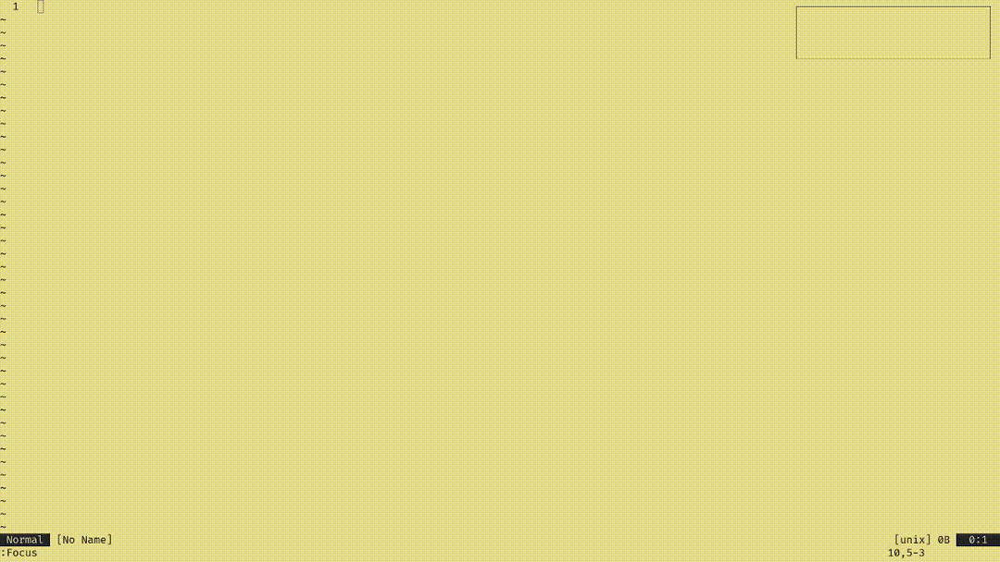

# focus.nvim

*A Neovim Plugin that provides a fast-paced number-clicking focus game.*



**Features:**

* Practice attention and speed directly inside Neovim.
* Automatically tracks accuracy, streaks, CPM, and completion time.
* Generates a randomized numbered grid based on your chosen size.
* To progress, simply click (or navigate to) each number in order.

**Installation:**
Add `leonardo-luz/focus.nvim` to your Neovim plugin manager (e.g., `init.lua` or `plugins/focus.lua`).

```lua
{
  'leonardo-luz/focus.nvim',
  opts = {
    map_size = {
      x = 6, -- Grid width  (default: 6)
      y = 6, -- Grid height (default: 6)
    },
  },
}
```

**Usage:**

* `:Focus` to start the practice session.
* Normal mode:

  * `q` or `<esc><esc>`: Quit
  * `x`: Check if the cursor is on the correct next number

## Contributing

Contributions are welcome! If you'd like to help improve `focus.nvim`, feel free to **open issues** or **submit pull requests**.
